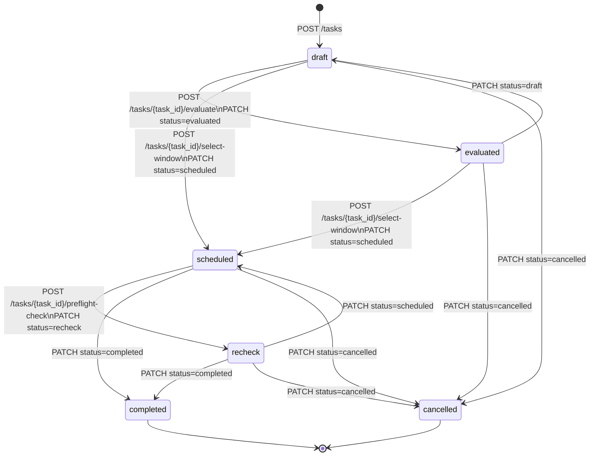
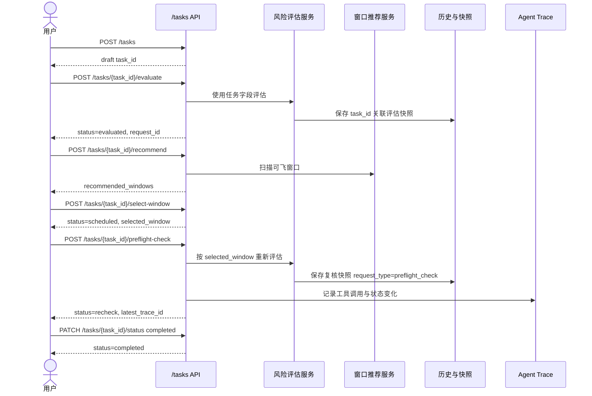

# Day140 任务单接口与状态流转说明

本文档对应第 21 周“任务单与任务状态管理”和 Day140“任务单联调、权限回归与文档”。

任务单是低空作业计划的业务聚合层，用于把一次未来作业相关的对话、评估、推荐窗口、规则快照、RAG 证据和 Trace 聚合到同一个 `task_id` 下。它不替代 Conversation History 和评估历史，历史记录仍保留独立表结构，并通过 `task_id` 与任务单关联。

## 1. 鉴权与权限边界

所有 `/tasks` 接口都需要登录态：

```http
Authorization: Bearer <access_token>
```

权限规则：

| 角色 | 能力 |
| --- | --- |
| 普通用户 | 只能创建、查看、修改和执行自己的任务单 |
| 管理员 | 可通过列表和详情接口审计全部任务单，可按 `user_id` 过滤 |
| 管理员 | 不允许修改、取消、完成或执行他人任务单 |
| 未登录用户 | 返回 `401` |
| 普通用户访问他人任务详情 | 返回 `404`，避免暴露任务是否存在 |
| 普通用户执行他人任务操作 | 返回 `403` |

## 2. 状态定义

| 状态 | 含义 |
| --- | --- |
| `draft` | 草稿。任务已创建，可继续补充字段或发起评估、推荐 |
| `evaluated` | 已完成计划时风险评估 |
| `scheduled` | 已选择推荐窗口或手工执行窗口 |
| `recheck` | 已完成执行前复核，最新结论以复核结果为准 |
| `completed` | 已完成，终态，不允许继续修改或排期类操作 |
| `cancelled` | 已取消，终态，不允许继续修改或排期类操作 |

允许的状态流转：



状态边界：

| 场景 | 结果 |
| --- | --- |
| `evaluated -> completed` | `409`，必须先进入 `scheduled` 或 `recheck` |
| `completed/cancelled -> 任意状态` | `409` |
| 修改 `completed/cancelled` 任务字段 | `409` |
| 对 `completed/cancelled` 执行评估、推荐、选择窗口、复核 | `409` |

## 3. 通用响应字段

`MissionTaskResponse`：

| 字段 | 类型 | 说明 |
| --- | --- | --- |
| `id` | string | 任务单 ID，也是历史、评估和 Trace 的关联键 |
| `user_id` | string | 任务归属用户 |
| `title` | string | 任务标题 |
| `purpose` | string/null | 作业目的 |
| `status` | string | 当前状态 |
| `location` | string/null | 作业地点 |
| `date` | string/null | 作业日期 |
| `start_time` | string/null | 计划开始时间 |
| `end_time` | string/null | 计划结束时间 |
| `task_type` | string/null | `cruise`、`inspection`、`hover`、`survey` |
| `candidate_locations` | string[] | 候选地点 |
| `selected_window` | object/null | 已选择执行窗口 |
| `latest_decision` | string/null | 最新风险结论 |
| `latest_request_id` | string/null | 最新评估或复核请求 ID |
| `latest_trace_id` | string/null | 最新 Trace ID |
| `latest_conversation_id` | string/null | 最新关联会话 ID |
| `created_at` | string | 创建时间 |
| `updated_at` | string | 更新时间 |

`MissionTaskDetailResponse` 在上述字段基础上增加：

| 字段 | 类型 | 说明 |
| --- | --- | --- |
| `profile_context` | object | 创建时从 Profile Memory 固化的上下文快照 |
| `metadata` | object | 任务扩展元数据，包含最近推荐、复核摘要等 |
| `conversation_ids` | string[] | 关联对话 ID |
| `request_ids` | string[] | 关联评估请求 ID |
| `trace_ids` | string[] | 关联 Trace ID |

## 4. 接口清单

### 4.1 查询任务列表

```http
GET /tasks?page=1&page_size=20&status=scheduled&keyword=巡检&user_id=user-a
```

查询参数：

| 参数 | 类型 | 必填 | 说明 |
| --- | --- | --- | --- |
| `page` | int | 否 | 默认 `1` |
| `page_size` | int | 否 | 默认 `20`，最大 `100` |
| `status` | string | 否 | 按任务状态过滤 |
| `keyword` | string | 否 | 匹配 `title` 或 `purpose` |
| `user_id` | string | 否 | 仅管理员有效，用于审计指定用户任务 |

响应：

```json
{
  "items": [
    {
      "id": "task-id",
      "user_id": "user-a",
      "title": "深圳湾巡检任务",
      "purpose": "执行前巡检",
      "status": "scheduled",
      "location": "深圳湾",
      "date": "2026-08-18",
      "start_time": "14:00",
      "end_time": "16:00",
      "task_type": "inspection",
      "candidate_locations": ["深圳湾"],
      "selected_window": null,
      "latest_decision": "适飞",
      "latest_request_id": "request-id",
      "latest_trace_id": "trace-id",
      "latest_conversation_id": "conversation-id",
      "created_at": "2026-08-17T10:00:00",
      "updated_at": "2026-08-17T10:10:00"
    }
  ],
  "page": 1,
  "page_size": 20,
  "total": 1
}
```

### 4.2 创建任务

```http
POST /tasks
Content-Type: application/json
```

请求体：

```json
{
  "title": "深圳湾巡检任务",
  "purpose": "执行前巡检",
  "location": "深圳湾",
  "date": "2026-08-18",
  "start_time": "14:00",
  "end_time": "16:00",
  "task_type": "inspection",
  "candidate_locations": ["深圳湾", "南山"],
  "profile_context": {
    "default_task_type": "inspection"
  },
  "metadata": {
    "source": "frontend"
  }
}
```

字段约束：

| 字段 | 必填 | 说明 |
| --- | --- | --- |
| `title` | 是 | 1 到 255 字符 |
| `task_type` | 否 | 仅允许 `cruise`、`inspection`、`hover`、`survey` |
| `profile_context` | 否 | 只在创建时固化，后续 Profile 变更不会自动覆盖任务 |
| `metadata` | 否 | 扩展元数据 |

响应：`201 Created`，返回 `MissionTaskResponse`，初始 `status` 为 `draft`。

### 4.3 查询任务详情

```http
GET /tasks/{task_id}
```

响应：`MissionTaskDetailResponse`。

用途：

| 字段 | 前端用途 |
| --- | --- |
| `conversation_ids` | 打开关联对话历史 |
| `request_ids` | 打开计划评估和执行前复核快照 |
| `trace_ids` | 展示工具调用链路和状态变化 |
| `metadata.latest_recommendation` | 展示最近一次窗口推荐 |
| `metadata.latest_preflight_check` | 展示最近一次执行前复核摘要 |

### 4.4 修改任务字段

```http
PATCH /tasks/{task_id}
Content-Type: application/json
```

请求体支持局部更新：

```json
{
  "title": "深圳湾低空巡检任务",
  "task_type": "survey",
  "candidate_locations": ["深圳湾", "前海"]
}
```

规则：

| 场景 | 结果 |
| --- | --- |
| 修改自己的非终态任务 | `200` |
| 修改他人任务 | 普通用户 `404`，管理员 `403` |
| 修改 `completed/cancelled` 任务 | `409` |

### 4.5 修改任务状态

```http
PATCH /tasks/{task_id}/status
Content-Type: application/json
```

请求体：

```json
{
  "status": "cancelled"
}
```

规则：

| 场景 | 结果 |
| --- | --- |
| 合法状态流转 | `200` |
| 非法状态流转 | `409` |
| 非法状态值 | `422` |

### 4.6 任务风险评估

```http
POST /tasks/{task_id}/evaluate
```

前置字段：

| 字段 | 必须 |
| --- | --- |
| `location` | 是 |
| `date` | 是 |
| `start_time` | 是 |
| `end_time` | 是 |
| `task_type` | 是 |

行为：

| 行为 | 说明 |
| --- | --- |
| 构造 `CruiseEvaluateRequest` | 使用任务单字段作为输入 |
| 写入评估历史 | `task_requests.task_id` 和 `cruise_assessments.task_id` 关联任务 |
| 更新任务 | `latest_request_id`、`latest_decision`、`status=evaluated` |

响应：`CruiseAssessmentResponse`，其中 `request.task_id` 和 `request.request_id` 会被补充。

缺少必填字段时返回：

```json
{
  "detail": {
    "message": "mission task missing required fields: location",
    "missing_fields": ["location"]
  }
}
```

状态码为 `422`。

### 4.7 推荐执行窗口

```http
POST /tasks/{task_id}/recommend
Content-Type: application/json
```

请求体：

```json
{
  "scan_hours": 72,
  "min_window_hours": 2
}
```

参数约束：

| 字段 | 默认 | 范围 |
| --- | --- | --- |
| `scan_hours` | `72` | `1` 到 `168` |
| `min_window_hours` | `2` | `1` 到 `24` |

前置字段：

| 字段 | 必须 |
| --- | --- |
| `location` | 是 |
| `date` | 是 |
| `task_type` | 是 |

行为：

| 行为 | 说明 |
| --- | --- |
| 调用推荐能力 | 使用任务地点、日期和任务类型扫描可飞窗口 |
| 写入任务 metadata | `metadata.latest_recommendation` 保存最近推荐结果 |
| 不自动选窗口 | 需要调用 `select-window` 明确选择 |

响应：`RecommendationResponse`，其中 `request.task_id` 会被补充。

### 4.8 选择执行窗口

```http
POST /tasks/{task_id}/select-window
Content-Type: application/json
```

方式一：按推荐排名选择。

```json
{
  "rank": 1
}
```

方式二：直接传入窗口。

```json
{
  "window": {
    "start_time": "2026-08-18T14:00:00+08:00",
    "end_time": "2026-08-18T16:00:00+08:00",
    "rank": 1,
    "decision": "适飞",
    "reason": "天气稳定",
    "source_request_id": "request-id"
  }
}
```

规则：

| 场景 | 结果 |
| --- | --- |
| 传 `rank` 且已有 `metadata.latest_recommendation` | 从推荐结果中匹配窗口 |
| 传 `window` | 直接固化该窗口 |
| 未传 `rank` 和 `window` | `409` |
| `rank` 找不到 | `409` |

行为：

| 行为 | 说明 |
| --- | --- |
| 写入 `selected_window` | 固化执行窗口 |
| 更新状态 | `status=scheduled` |

### 4.9 执行前复核

```http
POST /tasks/{task_id}/preflight-check
```

行为：

| 行为 | 说明 |
| --- | --- |
| 优先使用 `selected_window` | 如果窗口时间可解析，按已选窗口重新评估 |
| 重新生成评估快照 | 写入新的 `task_requests` 和 `cruise_assessments` |
| 记录 Trace | 生成 `TOOL_CALL`、`TOOL_RESULT`、`STATE_UPDATE` 三类事件 |
| 更新任务 | `latest_request_id`、`latest_trace_id`、`latest_decision`、`status=recheck` |
| 写入 metadata | `metadata.latest_preflight_check` 保存复核摘要 |

响应：`CruiseAssessmentResponse`，其中：

```json
{
  "request": {
    "task_id": "task-id",
    "request_id": "request-id",
    "request_type": "preflight_check"
  }
}
```

## 5. 主链路时序



## 6. Agent 任务单能力

Agent 层支持以下任务单 intent：

| intent | 工具能力 | 后端接口 |
| --- | --- | --- |
| `create_task` | 创建任务单 | `POST /tasks` |
| `evaluate_task` | 评估当前任务 | `POST /tasks/{task_id}/evaluate` |
| `recommend_task` | 推荐执行窗口 | `POST /tasks/{task_id}/recommend` |
| `select_task_window` | 选择推荐窗口 | `POST /tasks/{task_id}/select-window` |
| `preflight_check_task` | 执行前复核 | `POST /tasks/{task_id}/preflight-check` |

上下文规则：

| 上下文键 | 说明 |
| --- | --- |
| `current_task_id` | 当前会话最近操作的任务单 |
| `current_task_title` | 当前任务标题 |
| `last_recommended_windows` | 最近推荐窗口 |
| `selected_window_rank` | 最近选择的窗口排名 |

自然语言示例：

| 用户表达 | 预期 intent |
| --- | --- |
| “帮我创建一个深圳湾明天下午巡检任务” | `create_task` |
| “评估一下这个任务” | `evaluate_task` |
| “推荐可飞窗口” | `recommend_task` |
| “就选第一个窗口” | `select_task_window` |
| “执行前再检查一次” | `preflight_check_task` |

任务归属、状态机和终态锁定仍由任务单后端服务校验，Agent 不直接绕过权限修改数据库。

## 7. Day140 回归测试结果

已执行第 21 周任务单相关测试：

```powershell
.\.venv\Scripts\python.exe -m pytest tests/test_mission_task_model.py tests/test_llm_task_parser.py tests/test_task_orchestrator_parser_mode.py tests/test_task_orchestrator_agent_context.py tests/test_agent_mission_task_tools.py tests/test_mission_task_api.py tests/test_mission_task_execution_api.py -q
```

结果：

```text
31 passed, 4 warnings
```

已执行前端构建：

```powershell
npm run build
```

结果：

```text
tsc -b && vite build
✓ built
```

已覆盖能力：

| 能力 | 覆盖情况 |
| --- | --- |
| 任务创建、列表、详情、修改 | 已通过接口测试 |
| 状态合法流转与非法流转拒绝 | 已通过接口测试 |
| 终态任务锁定 | 已通过接口测试 |
| 普通用户隔离与管理员审计 | 已通过接口测试 |
| 任务评估写入 `task_id` 关联历史 | 已通过执行接口测试 |
| 推荐窗口与选择窗口 | 已通过执行接口测试 |
| 执行前复核生成新快照和 Trace | 已通过执行接口测试 |
| Agent 任务单工具和上下文复用 | 已通过 Agent 相关测试 |
| 前端任务单页面类型检查和生产构建 | 已通过 `npm run build` |

